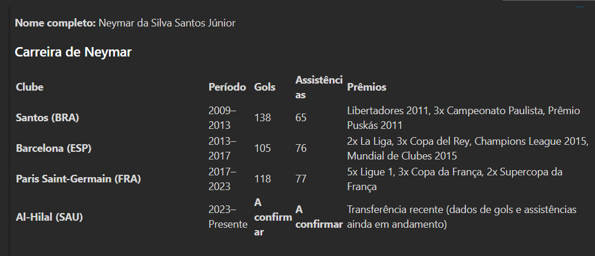

# PROJETO CURSO AZURE PLAYGROUND

O projeto consiste em explorar algumas ferramentas do azure.Todos os recursos e testes realizados foram salvos nos arquivos Json no repositório.

## FERRAMENTAS UTILIZADAS

* <a href="#playground">Plaground de chat</a>
* 

 ## Playgroud de chat

Com base nas Aulas criei um assistente que entende de Futebol e a partir de apenas um nome e te informa o historico e estatisticas do jogador citado exemplo:

