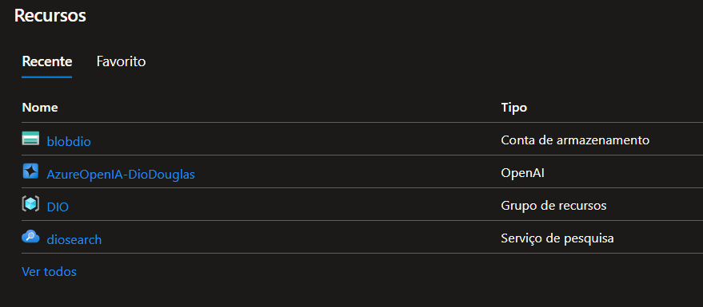

# PROJETO CURSO AZURE PLAYGROUND

O projeto consiste em explorar algumas ferramentas do azure.Todos os recursos e testes realizados foram salvos nos arquivos Json no repositório.

## FERRAMENTAS UTILIZADAS

* <a href="#playgroud-de-chat">Playground de chat</a>
* <a href="#criação-de-recursos">Criação de recursos</a>
* <a href="#considerações-finais">Considerações finais</a>

 ## Playgroud de chat

Com base nas Aulas criei um assistente que entende de Futebol e a partir de apenas um nome e te informa o historico e estatisticas do jogador citado exemplo:

## Criação de recursos

Foram criados os seguintes recursos: Conta de armazenamento,Grupo de recursos e serviço de pesquisas:

## Considerações finais

O primeiro contato com o Azure foi esclarecedor e permitiu conhecer o funcionamento básico de algumas ferramentas!

